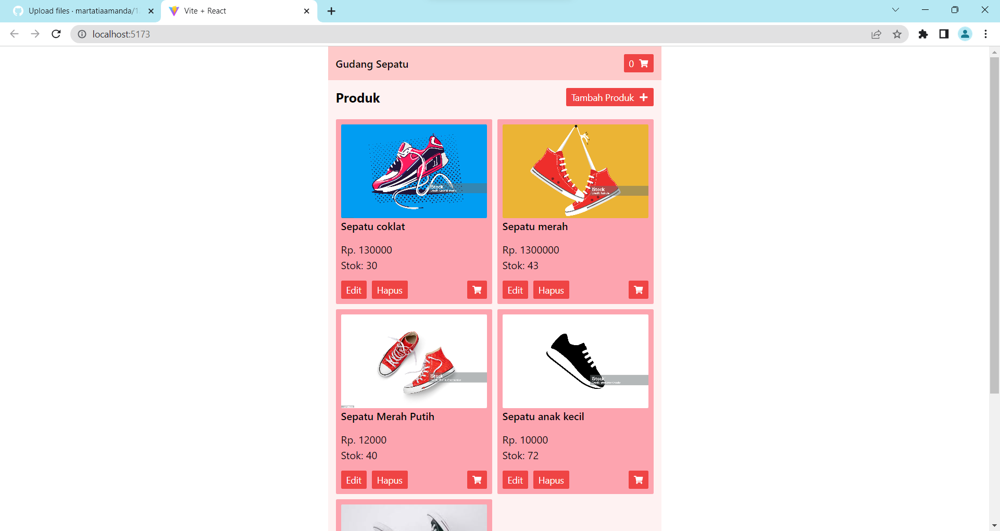
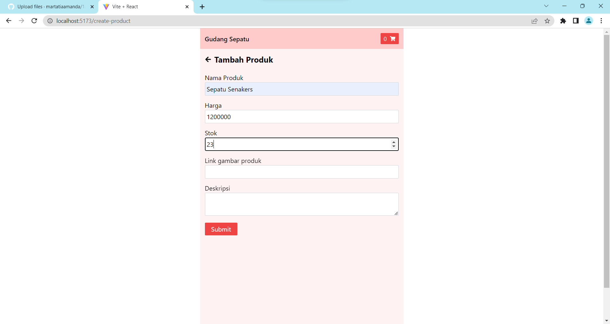
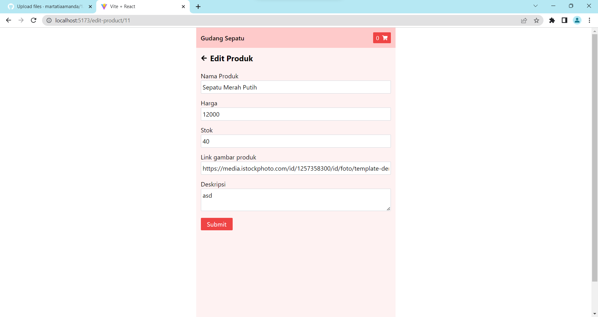
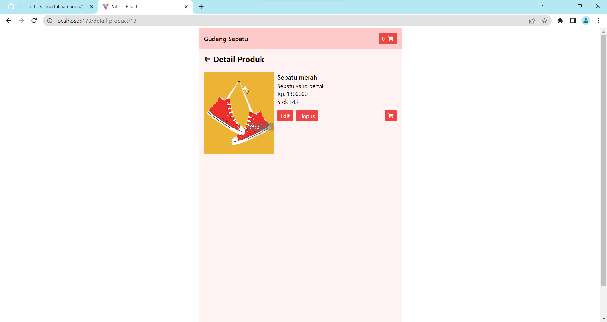

# 120140163 UTS PWL FRONTEND

## Cara menjalankan

peringatan: pastikan server backend sudah berjalan, jika belum silahkan lihat di instrusi di repository [backend](https://github.com/martatiaamanda/120140163-uts-pwl-backend)

1. Clone repository ini
2. Buka terminal dan arahkan ke folder repository ini
3. Jalankan perintah `npm install`
4. Jalankan perintah `npm start`

### Hasil

Berikut beberapa hasil screenshot dari aplikasi ini

#### Beranda

#### Tambah Produk

#### Edit Produk

#### Detail Produk

